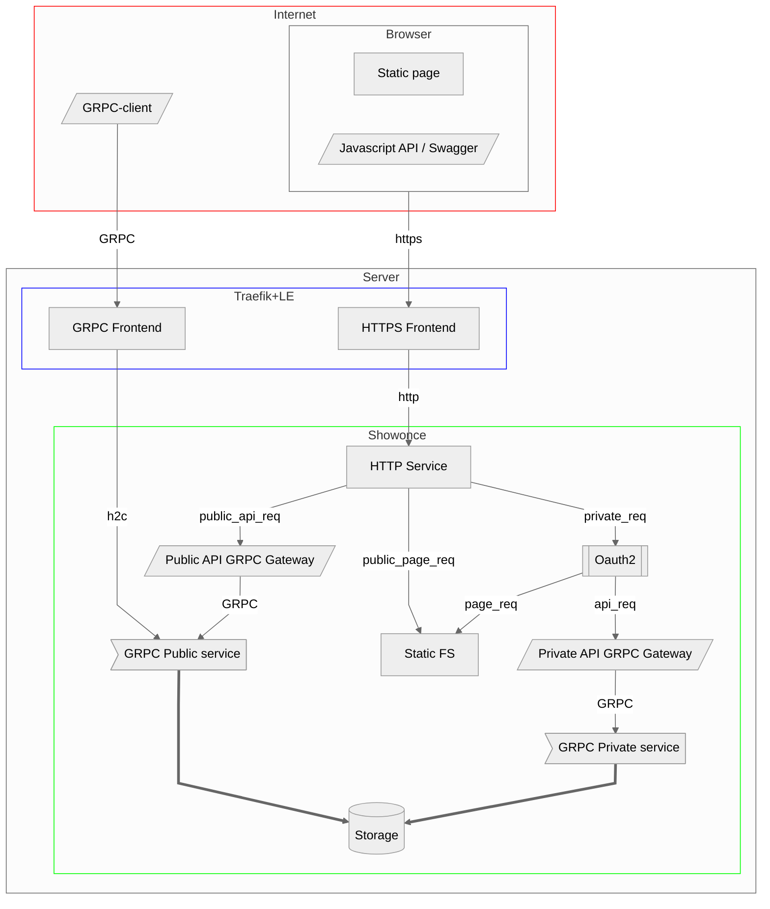
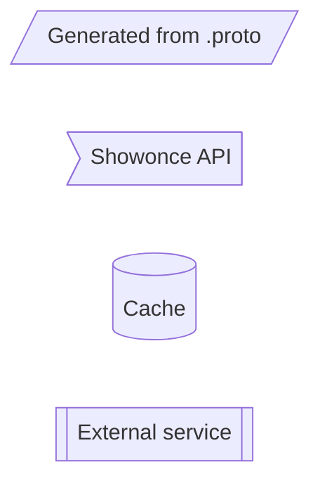

[![Go Reference][ref1]][ref2]
 [![GitHub Release][gr1]][gr2]
 [![Test Coverage][cct1]][cct2]
 [![Maintainability][ccm1]][ccm2]
 [![GoCard][gc1]][gc2]
 [![Build Status][bs1]][bs2]
 [![GitHub license][gl1]][gl2]

[cct1]: https://api.codeclimate.com/v1/badges/b8061e3ed9faa6819584/test_coverage
[cct2]: https://codeclimate.com/github/LeKovr/showonce/test_coverage
[ccm1]: https://api.codeclimate.com/v1/badges/b8061e3ed9faa6819584/maintainability
[ccm2]: https://codeclimate.com/github/LeKovr/showonce/maintainability
[ref1]: https://pkg.go.dev/badge/github.com/LeKovr/showonce.svg
[ref2]: https://pkg.go.dev/github.com/LeKovr/showonce
[gc1]: https://goreportcard.com/badge/github.com/LeKovr/showonce
[gc2]: https://goreportcard.com/report/github.com/LeKovr/showonce
[bs1]: https://github.com/LeKovr/showonce/actions/workflows/docker-publish.yml/badge.svg
[bs2]: http://github.com/LeKovr/showonce/actions/workflows/docker-publish.yml
[gr1]: https://img.shields.io/github/release/LeKovr/showonce.svg
[gr2]: https://github.com/LeKovr/showonce/releases
[gl1]: https://img.shields.io/github/license/LeKovr/showonce.svg
[gl2]: https://github.com/LeKovr/showonce/blob/master/LICENSE

# Шованс (Show once)

Сервис обмена текстами, которые доступны для чтения только один раз.

## Назначение

* Предоставить **Отправителю** возможность сохранить на сервере некий текстовый **секрет** (например, пароль) с некоторым случайным **идентификатором** и периодом актуальности
* Предоставить **Получателю** возможность однократно прочитать этот секрет при выполнении условий:
  * Передан идентификатор
  * Период актуальности еще не закончился
  * Запрос на доступ предоставляется впервые

В первой версии считается допустимым сценарий, при котором **Получатель** может получить фальшивый URL, пройти по ссылке и увидеть похожий сайт, который запросит информацию с легального, покажет ее пользователю и продублирует у себя в интересах третьих лиц.

## Диаграмма потока запросов



<details>
  <summary>Обозначения</summary>



</details>

### API

Для публичной части поддерживается интерфейс GRPC. См [Описание .proto](proto/)

Также доступен [JSON RPC](static/js/service.swagger.json)

## Состав проекта

Language|files|blank|comment|code
:-------|-------:|-------:|-------:|-------:
Go|9|116|115|672
JavaScript|2|22|18|367
YAML|11|39|84|357
Markdown|2|179|0|306
HTML|5|0|0|229
make|1|76|79|163
Protocol Buffers|1|18|20|116
CSS|1|18|0|81
Bourne Shell|1|14|11|53
Dockerfile|1|9|0|21
--------|--------|--------|--------|--------
SUM:|34|491|327|2365

## Аргументы сервиса

```
$ ./showonce -h
Usage:
  showonce [OPTIONS]

Application Options:
      --listen=               Addr and port which server listens at (default: :8080)
      --listen_grpc=          Addr and port which GRPC pub server listens at (default: :8081)
      --root=                 Static files root directory [$ROOT]
      --priv=                 URI prefix for pages which requires auth (default: /my/)
      --grace=                Stop grace period (default: 10s)

Logging Options:
      --log.debug             Show debug info
      --log.dest=             Log destination (defailt: STDERR)

Auth Service Options:
      --as.my_url=            Own host URL (autodetect if empty)
      --as.cb_url=            URL for Auth server's redirect (default: /login)
      --as.type=[gitea|mmost] Authorization Server type (gitea|mmost) (default: gitea) [$AS_TYPE]
      --as.do401              Do not redirect with http.StatusUnauthorized, process it [$AS_DO401]
      --as.host=              Authorization Server host (default: http://gitea:8080) [$AS_HOST]
      --as.team=              Authorization Server team which members has access to resource (default: dcape) [$AS_TEAM]
      --as.client_id=         Authorization Server Client ID [$AS_CLIENT_ID]
      --as.client_key=        Authorization Server Client key [$AS_CLIENT_KEY]
      --as.cache_expire=      Cache expire interval (default: 5m)
      --as.cache_cleanup=     Cache cleanup interval (default: 10m)
      --as.auth_header=       Use token from this header if given (default: X-narra-token)
      --as.cookie_domain=     Auth cookie domain
      --as.cookie_name=       Auth cookie name (default: narra_token)
      --as.cookie_sign=       Cookie sign key (32 or 64 bytes) [$AS_COOKIE_SIGN_KEY]
      --as.cookie_crypt=      Cookie crypt key (16, 24, or 32 bytes) [$AS_COOKIE_CRYPT_KEY]
      --as.user_header=       HTTP Response Header for username (default: X-Username) [$AS_USER_HEADER]
      --as.basic_realm=       Basic Auth realm (default: narra)
      --as.basic_username=    Basic Auth user name (default: token)
      --as.basic_useragent=   UserAgent which requires Basic Auth (default: docker/)

Storage Options:
      --db.meta_ttl=          Metadata TTL (default: 240h)
      --db.data_ttl=          Data TTL (default: 24h)
      --db.cleanup=           Cleanup interval (default: 10m)

Help Options:
  -h, --help                  Show this help message
```

## Алгоритм

**Отправитель**

* авторизуется
* открывает страницу "Создать"
* вводит атрибуты секрета
* нажимает "Сохранить"
* получает ссылку на доступ к секрету

**Получатель**

* открывает полученную ссылку
* видит название секрета, срок жизни и, если срок не истек и текст не был прочитан, ссылку "Показать"
* после нажатия "Показать" - видит сам текст
* при отправке текста адресату он удаляется на сервере и (в след версиях) формируется уведомление для **Отправителя**

**Отправитель**

* авторизуется
* на открывшейся после авторизации странице видит список своих текстов с атрибутами
  * ссылка
  * название
  * факт показа (в след версиях - IP адресата)
  * время показа (до показа - время удаления текста)
* (в след версиях) список может быть отфильтрован по
  * факту показа
  * значению поля "Группа"

## Карта сайта

Сервис представляет собой сайт со следующими страницами

* главная (/), содержит
  * описание сервиса
  * ссылку на авторизацию отправителя
  * поле ввода идентификатора текста
* метаданные секрета (/?id=XXX), содержит
  * все атрибуты текста (кроме контента)
  * ссылку "Показать" (если не было показа, иначе - время показа)
  * ссылку на показ контента (запрос POST /?id=XXX), которая возвращает
  * при первом запросе существующего непрочитанного контента - текст, иначе - 404
* кабинет отправителя (/my), доступен после авторизации и содержит
  * ссылку "создать"
  * статистику по созданным текстам
  * список созданных текстов (/my/items),содержит
    * список со ссылками (/?id=XXX) на созданные пользователем тексты
  * создание текста (/my/new), содержит
    * форму с атрибутами текста
    * кнопку "Создать"

## Дополнения

### ID

Для генерации идентификатора используется [ULID](https://github.com/oklog/ulid).
Это (в след версиях) позволит зашивать дату (создания или протухания)

### Уникальность секрета

Осуществляется хранением его sha1 (в след версиях)

### Хранение

Согласно юзкейса сервиса (передача пароля от админа к пользователю), повторное создание текста (генерация нового пароля) дешевле, чем потенциальный ущерб от компрометации этого текста.

Поэтому сам текст хранится только в памяти приложения и удаляется в случае

* показа получателю
* истечения срока хранения
* рестарта сервиса

Т.е. на диск тексты не пишутся, чтобы избежать шифрования, для которого придется где-то хранить ключ, который может утечь. Эта проблема, возможно, решаема с использованием таких техник, как [vault](https://github.com/hashicorp/vault), но для первой версии это принято нецелесообразным.

Вместе с тем, жизненный цикл у секрета и его метаданных разный, по истечении срока актуальности удаляется только сам секрет, а его метаданные хранятся до истечения Срока жизни метаданных, (в след версиях) метаданные будут храниться в персистентном хранилище.

Текущее решение: in-memory KV [zcache](https://zgo.at/zcache/v2).

### Авторизация отправителя

Цели:

* группировка текстов по автору
* исключение нецелевого использования сервиса

Первичное решение:

* gitea. **Отправитель**  должен быть членом заданной в настройках организации gitea, обмен с gitea производится по протоколу OAuth2

### Атрибут "Группа"

Задается при создании секрета. Первоначальное значение - `default`, отправитель может заменить это значение.

Назначение атрибута - (в след версиях) фильтрация списка созданных секретов в кабинете.

## См. также

* [Onetime Secret](https://onetimesecret.com/)
* [Password Pusher](https://pwpush.com/)
* [Hemmelig](https://hemmelig.app/)

## TODO

* [ ] js: если после GetMeta вышел срок актуальности, GetData доступна и возвращает `{"code":2,"message":"item not found"}`
* [ ] Подключить автогенерацию тестов для [генерируемых исходников](zdoc/)
* [ ] GRPC: добавить авторизацию пользователя по токену

## История изменений

См. [CHANGELOG](CHANGELOG.md)

## Лицензия

Copyright 2023 Aleksei Kovrizhkin <lekovr+github@gmail.com>

Исходный код проекта лицензирован под Apache License, Version 2.0 (the "[License](LICENSE)");
