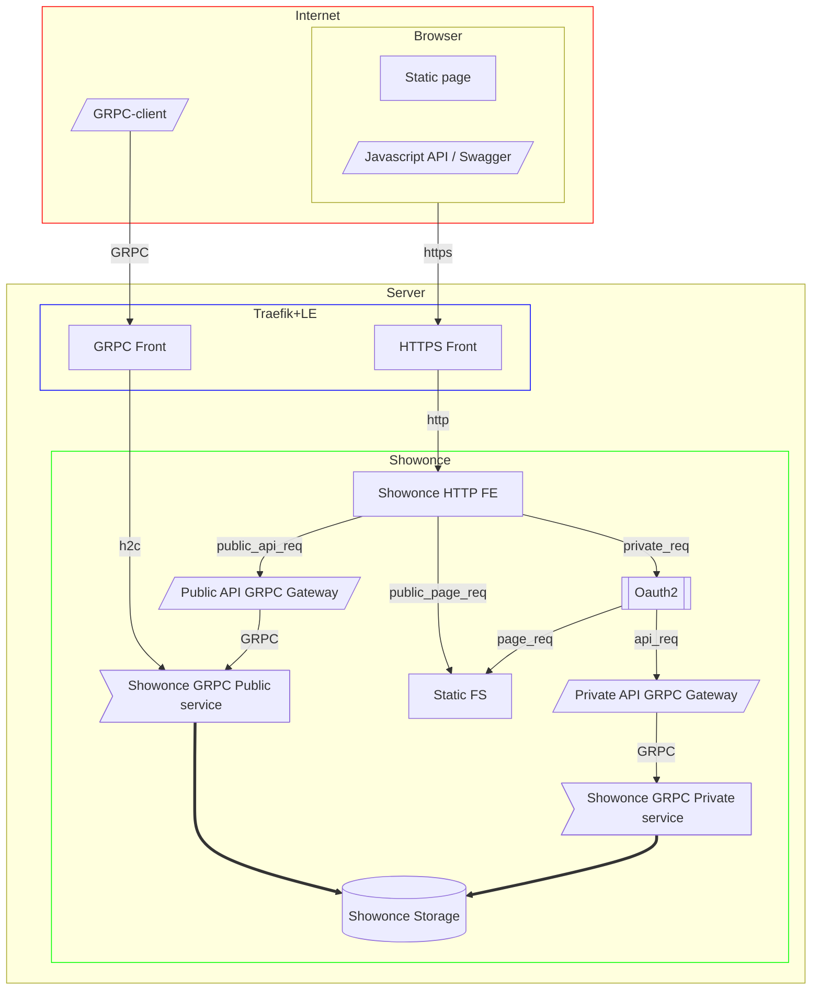
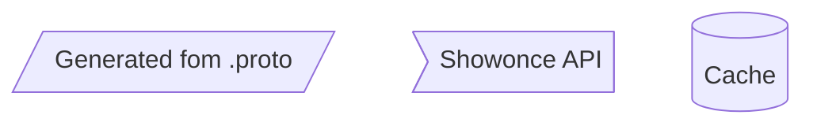

[![Go Reference][ref1]][ref2]
 [![GitHub Release][gr1]][gr2]
 [![Test Coverage][cct1]][cct2]
 [![Maintainability][ccm1]][ccm2]
 [![GoCard][gc1]][gc2]
 [![Build Status][bs1]][bs2]
 [![GitHub license][gl1]][gl2]

[cct1]: https://api.codeclimate.com/v1/badges/b8061e3ed9faa6819584/test_coverage
[cct2]: https://codeclimate.com/github/LeKovr/showonce/test_coverage
[ccm1]: https://api.codeclimate.com/v1/badges/b8061e3ed9faa6819584/maintainability
[ccm2]: https://codeclimate.com/github/LeKovr/showonce/maintainability
[ref1]: https://pkg.go.dev/badge/github.com/LeKovr/showonce.svg
[ref2]: https://pkg.go.dev/github.com/LeKovr/showonce
[gc1]: https://goreportcard.com/badge/github.com/LeKovr/showonce
[gc2]: https://goreportcard.com/report/github.com/LeKovr/showonce
[bs1]: https://github.com/LeKovr/showonce/actions/workflows/docker-publish.yml/badge.svg
[bs2]: http://github.com/LeKovr/showonce/actions/workflows/docker-publish.yml
[gr1]: https://img.shields.io/github/release/LeKovr/showonce.svg
[gr2]: https://github.com/LeKovr/showonce/releases
[gl1]: https://img.shields.io/github/license/LeKovr/showonce.svg
[gl2]: https://github.com/LeKovr/showonce/blob/master/LICENSE

# Шованс (Show once)

Сервис обмена текстами, которые доступны для чтения только один раз

## Назначение

* Предоставить **Отправителю** возможность сохранить на сервере некий текстовый **секрет** (например, пароль) с некоторым случайным **идентификатором** и периодом актуальности
* Предоставить **Получателю** возможность однократно прочитать этот секрет при выполнении условий:
  * Передан идентификатор
  * Период актуальности еще не закончился
  * Запрос на доступ предоставляется впервые

В первой версии считается допустимым сценарий, при котором **Получатель** может получить фальшивый URL, пройти по ссылке и увидеть похожий сайт, который запросит информацию с легального, покажет ее пользователю и продублирует у себя в интересах третьих лиц.

## Диаграмма потока запросов

## Атрибуты текста

* ID - уникальный идентификатор текста
* Название - описание текста, доступное многократно
* Контент - сам текст, удаляется после первого показа
* Группа - уникальный идентификатор группы текстов
* Статус - (Wait/Read/Expired - готов к показу/показан/просрочен)
* Время создания - момент создания текста
* Время последнего изменения (первоначально - срок автоудаления, после показа - момент показа)

## Алгоритм

**Отправитель**

* авторизуется
* открывает страницу "Создать"
* вводит информацию
* нажимает "Сохранить"
* получает ссылку на доступ к информации

**Получатель**

* открывает ссылку доступа
* видит название текста, срок жизни и ссылку "Показать"
* после нажатия "Показать" - видит сам текст
* при отправке текста адресату он удаляется на сервере и (в след версиях) формируется уведомление для **Отправителя**

**Отправитель**

* авторизуется
* на открывшейся после авторизации странице видит список своих текстов с атрибутами
  * ссылка
  * название
  * факт показа (в след версиях - IP адресата)
  * время показа (до показа - время удаления текста)
* (в след версиях) список может быть отфильтрован по
  * факту показа
  * значению поля "Группа"

## Архитектура

### Карта сайта

Сервис представляет собой сайт со следующими страницами

* главная (/), содержит
  * описание сервиса
  * ссылку на авторизацию отправителя
  * поле ввода идентификатора текста
* метаданные текста (/?id=XXX), содержит
  * все атрибуты текста (кроме контента)
  * ссылку "Показать" (если не было показа, иначе - время показа)
* ссылку на показ контента (запрос POST /?id=XXX), которая возвращает
  * при первом запросе существующего непрочитанного контента - текст, иначе - 404
* кабинет отправителя (/my), доступен после авторизации и содержит
  * ссылку "создать"
  * статистику по созданным текстам
* список созданных текстов (/my/items),содержит
  * список со ссылками (/?id=XXX) на созданные пользователем тексты
* создание текста (/my/new), содержит
  * форму с атрибутами текста
  * кнопку "Создать"

### API

Для публичной части поддерживается интерфейс GRPC. Также доступен [JSON RPC](static/js/service.swagger.json)

См также: [Описание .proto](proto/)

### ID

Для генерации идентификатора используется [ULID](https://github.com/oklog/ulid).
Это (в след версиях) позволит зашивать дату (создания или протухания)

### Уникальность секрета

Осуществляется хранением его sha1 (в след версиях)

### Хранение

Согласно юзкейса сервиса (передача пароля от админа к пользователю), повторное создание текста (генерация нового пароля) дешевле, чем потенциальный ущерб от компрометации этого текста.

Поэтому сам текст хранится только в памяти приложения и удаляется в случае

* показа получателю
* истечения срока хранения
* рестарта сервиса

Т.е. на диск тексты не пишутся, чтобы избежать шифрования, для которого придется где-то хранить ключ, который может утечь. Эта проблема, возможно, решаема с использованием таких техник, как [vault](https://github.com/hashicorp/vault), но для первой версии это принято нецелесообразным.

Вместе с тем, жизненный цикл у метаданных текста иной, информация о его судьбе должна храниться дольше (до Срока жизни метаданных), поэтому (в след версиях) метаданные будут храниться в персистентном хранилище.

Текущее решение: in-memory KV [zcache](https://zgo.at/zcache/v2).

### Авторизация отправителя

Цели:

* группировка текстов по автору
* исключение нецелевого использования сервиса

Первичное решение:

* gitea. **Отправитель**  должен быть членом заданной в настройках организации gitea, обмен с gitea производится по протоколу OAuth2

## Дополнения

### Атрибуты

### Группа

Задается в форме с атрибутами текста. Первоначальное значение - `default`, отправитель может заменить это значение.

Назначение атрибута - (в след версиях) фильтрация списка созданных текстов в кабинете

## См. также

* [Onetime Secret](https://onetimesecret.com/)
* [Password Pusher](https://pwpush.com/)
* [Hemmelig](https://hemmelig.app/)

## История изменений

* v1.0.0, 29.07.2023 - рефакторинг с изменением архитектуры на GRPC
* v0.2.0, 9.12.2022
  * незначительный рефакторинг
  * предварительная доработка стилей
  * переезд на dopos/narra
* v0.1.1, 7.07.2022 - релиз, доработан ввод срока жизни, добавлен деплой в dcape
* v0.0.2, 6.07.2022 - MVP, начало тестирования
* v0.0.1, 29.06.2022 - начало работ, предварительный вариант ТЗ

## Лицензия

Copyright 2023 Aleksei Kovrizhkin <lekovr+github@gmail.com>

Исходный код проекта лицензирован под Apache License, Version 2.0 (the "[License](LICENSE)");
